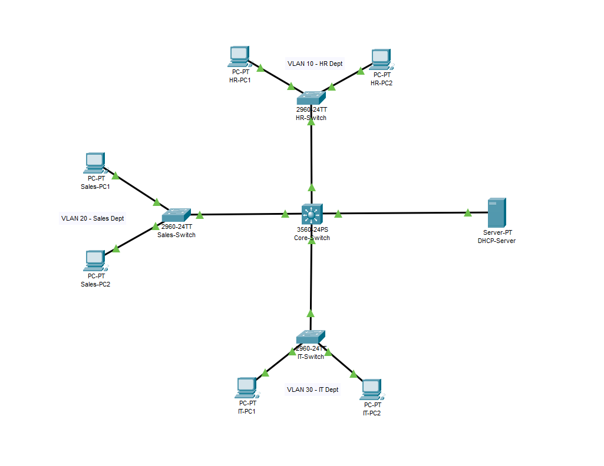
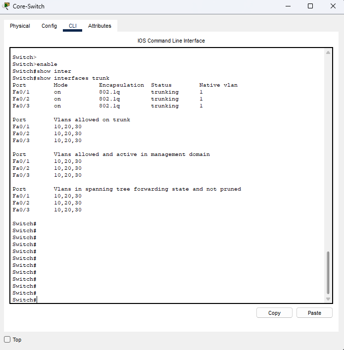
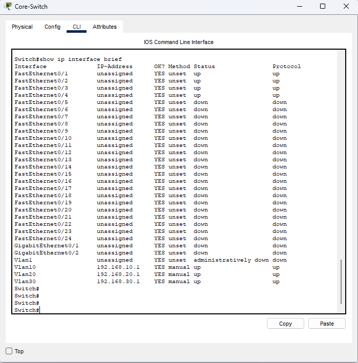
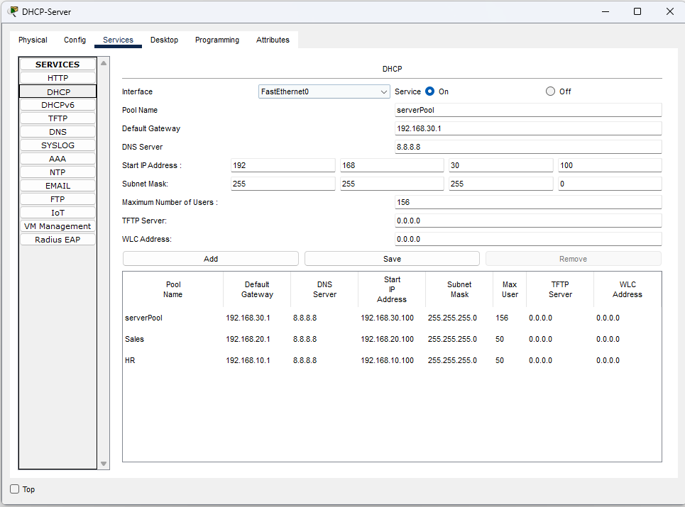
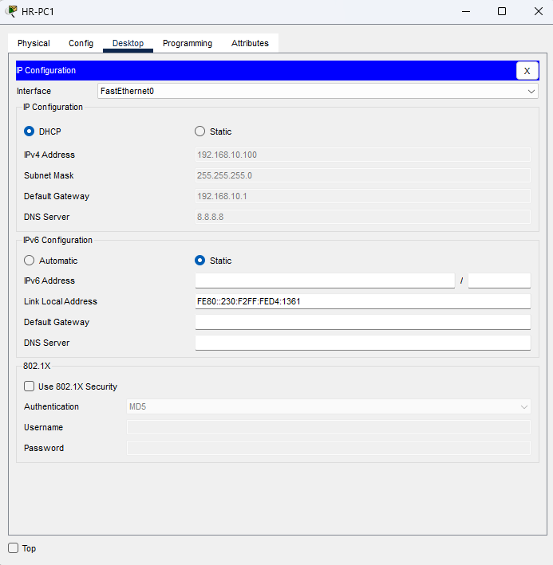
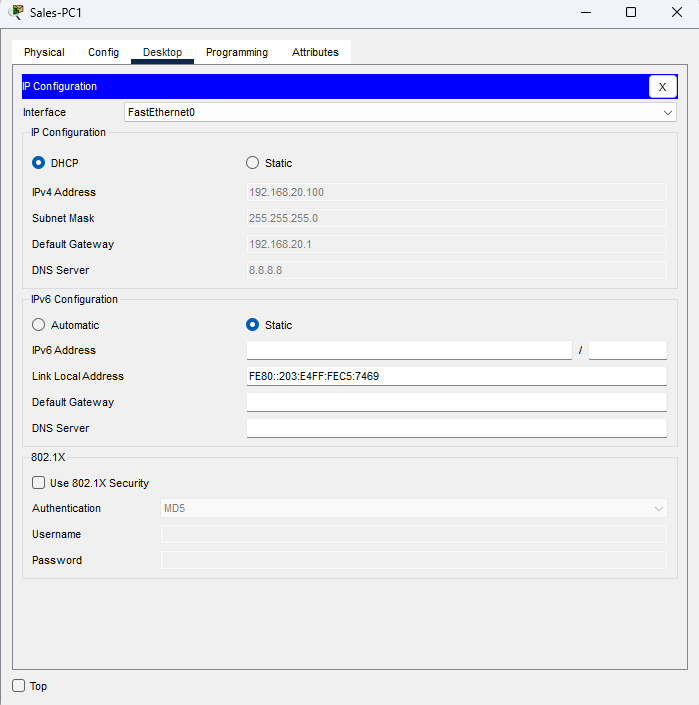
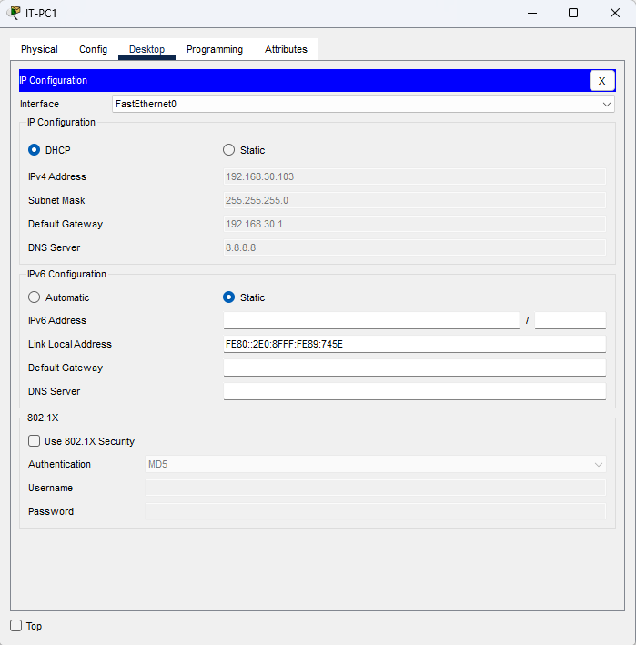

# Project 1: Simulated Business Network in Cisco Packet Tracer

## Objective
Design and implement a small business network using Cisco Packet Tracer. The network includes VLAN segmentation for three departments, a Layer 3 switch for inter-VLAN routing, and a centralized DHCP server for IP address distribution.

## Devices Used
- Cisco 2960 Switches (3 total): HR, Sales, IT departments
- Cisco 3560 Layer 3 Switch (1): Core Switch
- PCs (6 total): Two per department
- DHCP Server (1): Assigns IP addresses to all devices

## Network Design

| Department | VLAN ID | IP Range         | Devices             |
|------------|---------|------------------|---------------------|
| HR         | 10      | 192.168.10.0/24  | HR-PC1, HR-PC2      |
| Sales      | 20      | 192.168.20.0/24  | Sales-PC1, Sales-PC2|
| IT         | 30      | 192.168.30.0/24  | IT-PC1, IT-PC2      |

## Configuration Overview
- Created VLANs 10, 20, and 30 on the access switches
- Assigned switch ports to the appropiate VLANs
- Each department's PCs are isolated on their own VLAN
- Configured trunk links between access switches and the core switch
- Enabled inter-VLAN routing on the Layer 3 core switch
- DHCP pools created for all VLANs
- IP helper-address used on Core to forward DHCP

## Test Cases
- All PCs successfully receive IP addresses from the DHCP server
- Devices within the same VLAN can communicate with each other
- Devices accross VLANs can communicate via inter-VLAN routing
- Access Control Lists (ACLs) may be added to restric communication between specficic departments (e.g., block HR access to IT)

## Screenshots

### 1. Full Topology

### 2. Core Switch – Trunk Ports

### 3. Core Switch – SVI Status

### 4. DHCP Pools

### 5. PC DHCP Assigned IPs
- HR:
  
- Sales:
  
- IT:
  

## Packet Tracer DHCP Quirk (Important)

> **Note:** In Cisco Packet Tracer, the DHCP server automatically creates a default pool called `ServerPool` based on its own static IP subnet. This internal pool can override any custom pool you define for the same subnet. In this project, I modified the `ServerPool` directly to assign IPs starting from `.100` for the IT department (VLAN 30).  
> This behavior does **not** occur in real-world setups, where the DHCP server always follows configured pools. This is a known Packet Tracer limitation.
